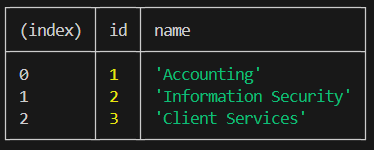
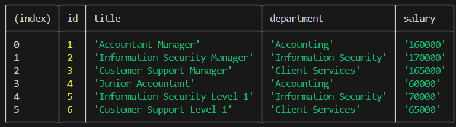
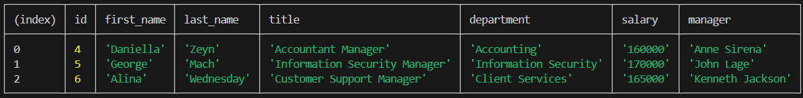
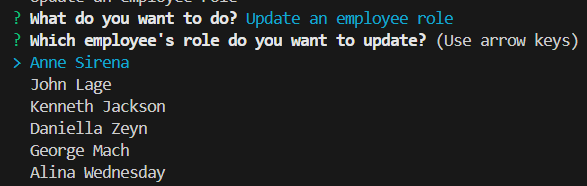
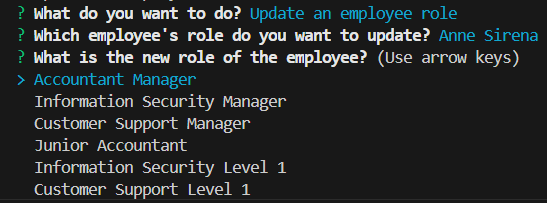
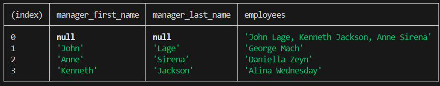
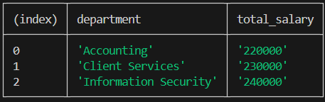

# 10 SQL: Employee Tracker

**GitHub Repo:** https://github.com/antoninast/module-10-challenge-employee-tracker

**Video Link:** To be added soon

## Description
The Business Management CLI Application allows business owners to manage and organize their company's departments, roles, and employees. This application provides a command-line interface (CLI) where users can:

- View departments, roles, and employees

- Add new departments, roles, and employees
- Delete departments, roles, and employees
- Update employee roles and managers

- View employees by managers

- View combined salaries by department

## Installation and setup
1. Clone the repo
2. In the main directory run:
`npm install`
3. Create `.env` file in the main directory with the following variables and set your values for them:
- DB_NAME
- DB_USER
- DB_PASSWORD

4. In order to start the application you should run the following command in the main directory:
`npm run start`
